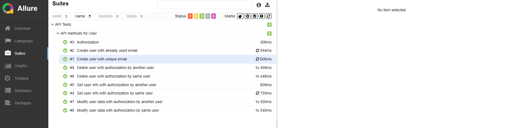

# Проект по тестированию API для тестового API LearnQA API
> <a target="_blank" href="https://playground.learnqa.ru/api/map">Swagger тестового API</a>

## Используемый стек технологий и инструментов
|                        Python                         |                          Pytest                          |                       Requests                        |                        Git                         |                        Jenkins                         |                        Allure                         |                        Allure TestOps                         |                         Telegram                         |
|:---:|:---:|:---:|:---:|:---:|:---:|:---:|:---:|
|  |  |  |  |  |  |  |   |

## Tесты
<ul style="list-style-type: '\2705 &#160'">
    <li>Create user with unique email</li>
    <li>Create user with already used email</li>
    <li>Authorization</li>
    <li>Get user info with authorization by same user</li>
    <li>Get user info with authorization by another user</li>
    <li>Modify user data with authorization by same user</li>
    <li>Modify user data with authorization by another user</li>
    <li>Delete user with authorization by same user</li>
    <li>Delete user with authorization by another user</li>
</ul>

##  Запуск проекта в Jenkins
#### Для запуска автотестов в Jenkins
1. __Открыть проект <a href="https://jenkins.autotests.cloud/job/c16-api_tests_learn_qa/">в Jenkins</a>__
2. __Нажать кнопку `Build`__
3. __Результат запуска сборки можно посмотреть в отчете Allure__

##  Отчет в Allure report
>__Просмотр результатов выполнения тестов в Allure report__

>__Отчет позволяет получить общую информацию о прохождении тестов__

>__Отчет позволяет получить информацию о прохождении каждого теста__
>__Каждый тесто содержит детальную информацию по всем шагам тестов, включая подробное логирование всех запросов:__

##  Оповещения в Telegram
>__После выполнения тестов, в Telegram bot приходит сообщение с графиком и информацией о тестовом прогоне. __
> 
